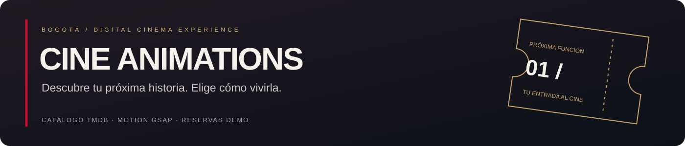
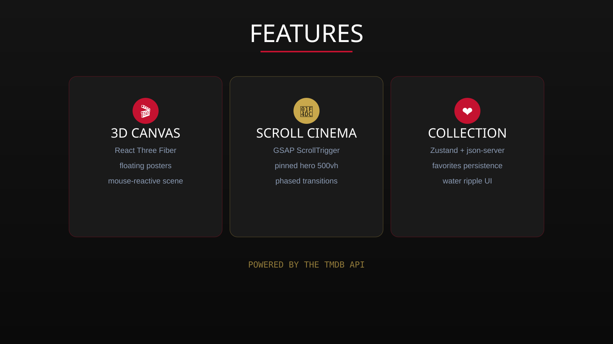

<div align="center">

# 🎬 CINE ANIMATIONS

**A premium interactive cinema experience.** A single-page application that fuses 3D scenes, scroll-driven cinematic animation, and a curated movie library — all powered by the TMDB API.



<br/>

[](package.json)
[](https://react.dev)
[](https://vite.dev)
[](https://threejs.org)
[](https://gsap.com)
[](#license)

</div>

---

## ✨ Features



| Area | Details |
|------|---------|
| **3D Canvas** | React Three Fiber scene with floating movie posters, mouse-reactive camera and depth layers |
| **Scroll Cinema** | GSAP ScrollTrigger pinned hero with a 5-phased, 500vh scroll experience |
| **TMDB Integration** | Trending, top-rated, now-playing, search, cast & crew and detailed movie pages |
| **Favorites** | Zustand global state + `json-server` persistence with a water-ripple UI |
| **Trailers** | Native `<dialog>` modal with embedded YouTube trailers & related videos |
| **Auth Flow** | Simulated login/register with social auth options |
| **Polish** | Custom magnetic cursor, film grain, scan-lines, noise overlay, letterboxing |
| **Playwright CLI** | Cross-browser end-to-end testing (Chromium, Firefox, Webkit, Mobile) |

---

## 🛠 Tech Stack

- **React 18** + **Vite 6**
- **React Three Fiber / drei / three**
- **GSAP + ScrollTrigger**
- **Framer Motion**
- **Tailwind CSS**
- **Zustand** (state)
- **lucide-react** (icons)
- **json-server** (local API)
- **Playwright** (E2E testing)

---

## 🚀 Getting Started

### Prerequisites

- **Node.js** `>= 18`
- A **TMDB API Key** and **Bearer Token** — get them from [themoviedb.org](https://www.themoviedb.org/settings/api)

### Installation

```bash
# 1. Clone the repository
git clone https://github.com/your-user/cine-animations.git
cd cine-animations

# 2. Install dependencies
npm install

# 3. Configure environment variables
cp .env.example .env
#   then edit .env and fill in your TMDB credentials:
#   VITE_TMDB_API_KEY=your_api_key
#   VITE_TMDB_TOKEN=your_bearer_token

# 4. Start the development servers (Vite + json-server)
npm run dev
```

Open [http://localhost:5173](http://localhost:5173) in your browser.

> **Note:** The TMDB `Bearer` token is required for authenticated API requests. The app gracefully degrades when missing, but content will be limited.

### Environment Variables

| Variable | Description | Default |
|----------|-------------|---------|
| `VITE_TMDB_API_KEY` | TMDB API key | — |
| `VITE_TMDB_TOKEN` | TMDB v4 Bearer token | — |
| `VITE_TMDB_BASE_URL` | TMDB API base URL | `https://api.themoviedb.org/3` |
| `VITE_TMDB_IMAGE_BASE` | TMDB image CDN base | `https://image.tmdb.org/t/p` |
| `VITE_JSON_SERVER_URL` | Favorites API endpoint | `http://localhost:3001` |

---

## 📝 Available Scripts

| Script | Description |
|--------|-------------|
| `npm run dev` | Start Vite + json-server together |
| `npm run dev:vite` | Start Vite only |
| `npm run dev:api` | Start json-server only |
| `npm run build` | Production build |
| `npm run preview` | Preview the production build |
| `npm run lint` | Run ESLint |

### Playwright CLI

| Script | Description |
|--------|-------------|
| `npm run test:e2e` | Run the E2E test suite (headless) |
| `npm run test:e2e:ui` | Open the interactive Playwright UI |
| `npm run test:e2e:headed` | Run tests with visible browser |
| `npm run test:e2e:report` | Open the HTML report |
| `npm run pw:install` | Install the Playwright browsers |

Before running E2E tests the first time:

```bash
npm run pw:install
npm run test:e2e
```

---

## 🧪 Project Structure

```
cine-animations/
├── public/                 # static assets
├── src/
│   ├── api/                # TMDB API wrapper (Bearer auth)
│   ├── components/         # all UI + scene components
│   ├── hooks/              # useMouse, useMovies, useGenres, etc.
│   ├── store/              # Zustand global store
│   ├── styles/             # global CSS + cinema theme
│   ├── utils/              # lerp, easing, math helpers
│   ├── App.jsx             # app shell, section routing, modals
│   └── main.jsx            # React entry
├── tests/                  # Playwright E2E tests
├── docs/                   # README images
├── db.json                 # json-server favorites db
├── playwright.config.js    # E2E configuration
└── vite.config.js          # Vite + chunk-splitting config
```

---

## 📸 Screenshots

> Skip a screenshot of your running app into a `docs/` folder and reference it here:

```

```

---

## 🧠 Architecture Notes

- **Pinned hero:** `HeroSection` uses a `500vh` section with a `sticky` stage; GSAP orchestrates 5 animation phases as the user scrolls.
- **State:** `useStore` is a Zustand store handling sections, favorites (with `json-server` persistence), auth, and the trailer modal.
- **API:** `src/api/tmdb.js` centralizes TMDB calls behind a single `apiFetch` helper with Bearer auth and `es-ES` locale.
- **Code splitting:** large 3D/three chunks are split via `manualChunks` in `vite.config.js`.

---

## 🤝 Contributing

1. Fork the repository
2. Create a feature branch: `git checkout -b feat/awesome-feature`
3. Commit with conventional messages + emojis (see below)
4. Push and open a Pull Request

### Commit Convention

This repo uses **Conventional Commits** with **emoji types**:

```
:tada: feat:     new feature
:bug: fix:       bug fix
:fire: perf:     performance improvement
:recycle: refactor:  code refactor (no behavior change)
:sparkles: style:    styling / UI polish
:test_tube: test:    adding or updating tests
:books: docs:        documentation
:memo: chore:        tooling / maintenance
```

---

## 📄 License

[MIT](LICENSE)

---

<div align="center">
  <sub>Built with ❤️ using React, Three.js, GSAP & the TMDB API.</sub>
</div>
