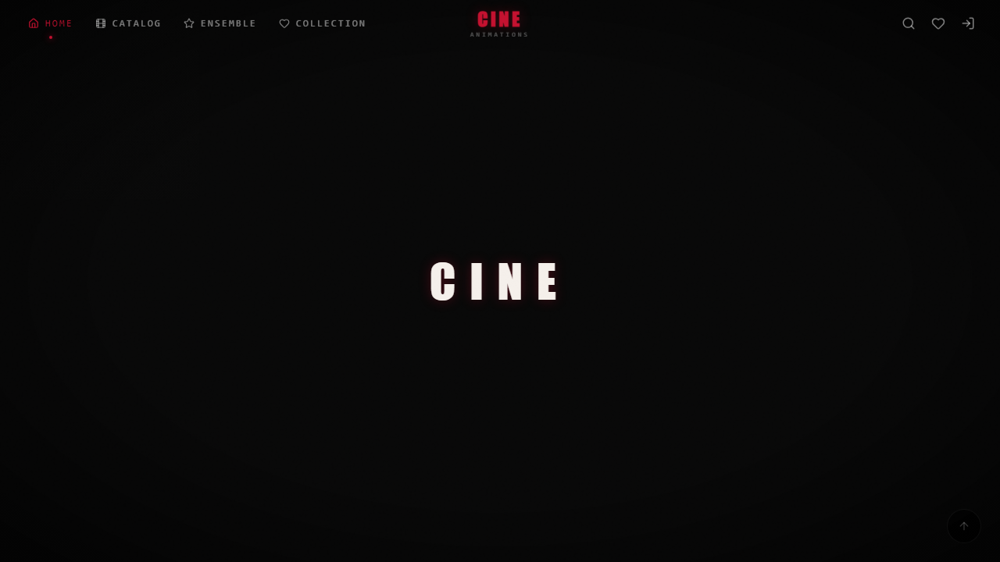
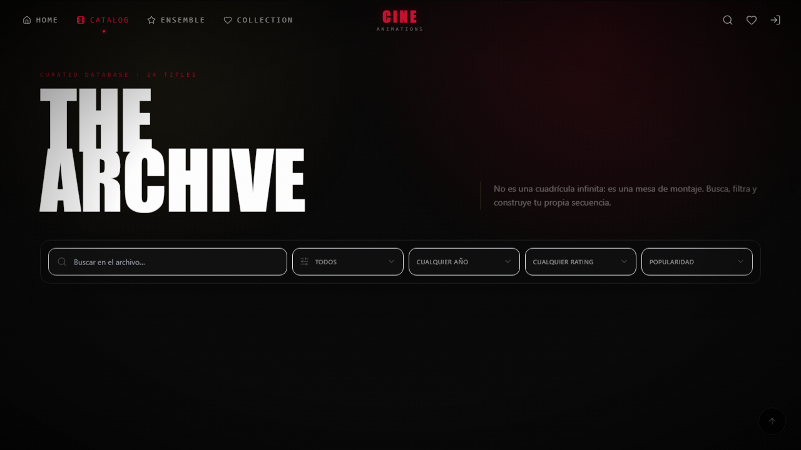
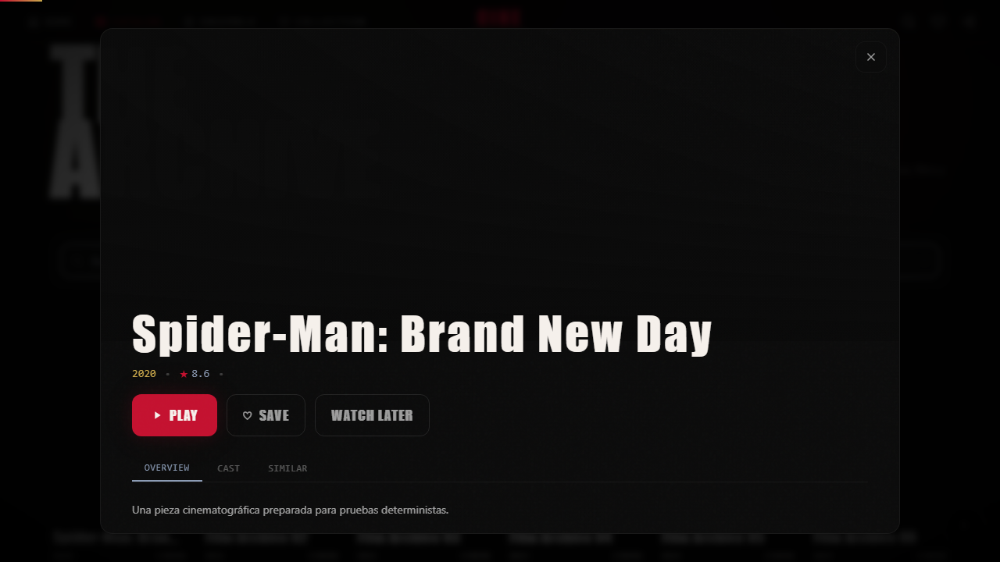
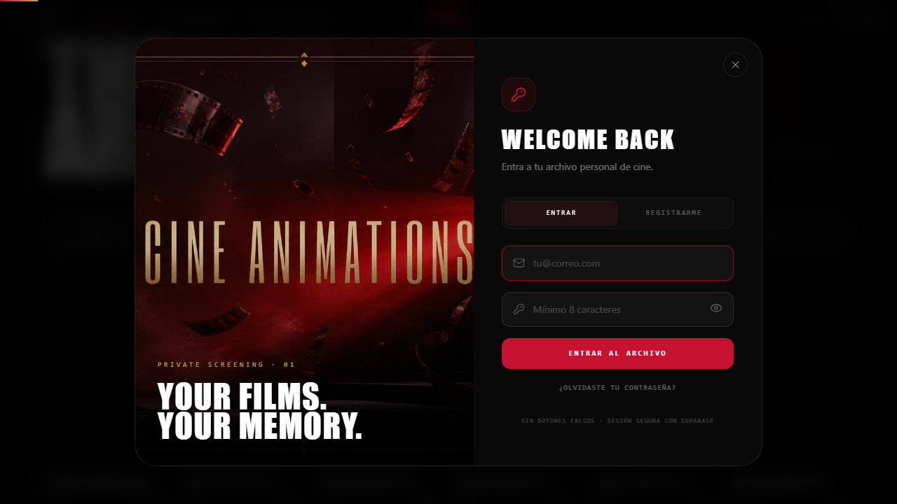
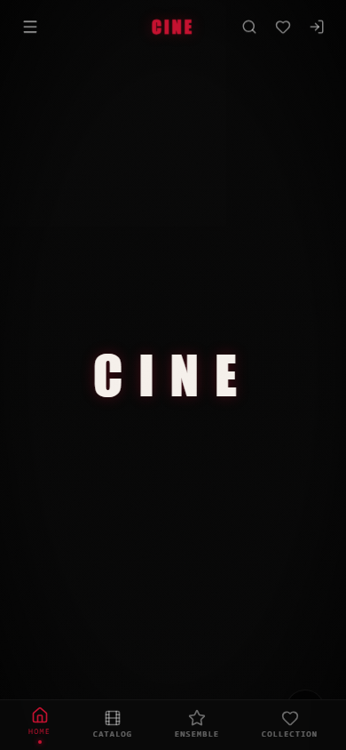

# CINE ANIMATIONS

Experiencia cinematográfica inmersiva construida como una SPA editorial: narrativa guiada por scroll, tipografía cinética, WebGL, transiciones continuas y un archivo de películas conectado a Supabase.



## Experiencia

- Hero de cinco actos y `500vh` orquestado con GSAP ScrollTrigger.
- Scroll suave Lenis sincronizado con el ticker de GSAP.
- Escena React Three Fiber, parallax, cursor magnético, máscaras de imagen y cards 3D.
- Transiciones de sección con Framer Motion, marquesinas y reveals escalonados.
- Catálogo con búsqueda, filtros, orden, paginación progresiva y command palette con `/`.
- Detalle de película, créditos, trailers YouTube sin cookies y contenido relacionado.
- Autenticación Supabase completa: registro, confirmación, login, recuperación y actualización de contraseña.
- Favoritos y “Ver después” para invitados, con fusión segura al iniciar sesión.
- Estados de carga, error, vacío, reintento y una variante `prefers-reduced-motion`.
- Interacciones adaptadas para mouse, teclado, touch y móvil.

## Stack

React 18, Vite 6, Tailwind CSS, GSAP + ScrollTrigger, Lenis, Framer Motion, Three.js, React Three Fiber, Zustand, Supabase y Playwright.

## Arquitectura

```text
src/
├── api/                 Adaptador de catálogo Supabase y fallback TMDB
├── components/          Secciones, modales, escenas y primitivas de motion
│   └── animations/      Marquee, TextScramble, counters y magnetic UI
├── hooks/               Ciclos de datos, cursor y section reveals
├── lib/                 Supabase, validación y timelines reutilizables
├── store/               Estado global, auth y colecciones
└── styles/              Sistema visual, utilidades GPU y reduced motion
supabase/
├── migrations/          Esquema, índices, privilegios y políticas RLS
└── tests/               Contratos de seguridad reproducibles
tests/                   Unitarias, E2E, accesibilidad y regresión visual
docs/screenshots/        Evidencia visual generada por Playwright
```

El catálogo se normaliza al contrato estable `Movie` en `src/api/catalog.js`. Supabase es la fuente principal; TMDB solo actúa como enriquecimiento o fallback opcional y la aplicación desplegada no requiere un token Bearer privado en el navegador.

## Instalación

Requisitos: Node.js 22 o superior y npm 10 o superior.

```bash
git clone https://github.com/DEIMER-PY/cine-animations.git
cd cine-animations
npm ci
cp .env.example .env
npm run dev
```

La aplicación queda disponible en `http://localhost:5173`.

### Variables de entorno

| Variable | Requerida | Uso |
| --- | --- | --- |
| `VITE_SUPABASE_URL` | Sí | URL pública del proyecto Supabase |
| `VITE_SUPABASE_PUBLISHABLE_KEY` | Sí | Clave publicable; nunca usar `service_role` |
| `VITE_TMDB_API_KEY` | No | Enriquecimiento opcional |
| `VITE_TMDB_TOKEN` | No | Fallback local opcional; no usar en producción pública |
| `VITE_TMDB_BASE_URL` | No | Base de TMDB |
| `VITE_TMDB_IMAGE_BASE` | No | CDN de imágenes TMDB |

## Supabase

La migración `supabase/migrations/20260827010000_cinema_public_experience.sql` agrega `profiles`, `user_favorites`, `user_watchlist`, índices, privilegios y políticas RLS de propietario basadas en `(select auth.uid())`. La lectura pública se limita al catálogo publicado.

Las tablas legadas `Usuario`, `RefreshToken`, `Favorito` y `Watchlist` permanecen intactas y sin exposición pública.

```bash
supabase link --project-ref YOUR_PROJECT_REF
supabase db push
```

Después del despliegue, añade la URL pública y su callback `/` a las Redirect URLs de Supabase Auth.

## Scripts

| Comando | Resultado |
| --- | --- |
| `npm run dev` | Desarrollo Vite |
| `npm run build` | Bundle de producción |
| `npm run preview` | Preview local del bundle |
| `npm run lint` | ESLint sobre `src` |
| `npm run test` | Vitest: adaptadores, store y validación |
| `npm run test:e2e` | Matriz Playwright |
| `npm run pw:install` | Chromium, Firefox y WebKit |
| `npm run test:all` | Lint + unitarias + build + E2E |

Los E2E cubren hero, navegación, command palette, catálogo, filtros, detalle, auth, favoritos, watchlist, persistencia, teclado, touch, consola y accesibilidad. Los servicios externos se estabilizan con fixtures de red para evitar falsos negativos.

## Evidencia visual

| Superficie | Captura |
| --- | --- |
| Catálogo |  |
| Detalle |  |
| Login |  |
| Móvil |  |

La tarjeta social `public/og-cine-animations.png` es una pieza original generada para el proyecto; no reutiliza recursos de las webs de referencia.

## Flujo Git

La rama de integración es `develop`. Cada responsabilidad se trabajó en una rama `codex/feature/*` y se fusiona con commits convencionales y gitmoji:

```text
:sparkles: feat: add immersive catalog discovery
:lock: feat: secure auth and collections with Supabase
:test_tube: test: expand visual and functional coverage
:books: docs: document cinematic architecture
```

CI ejecuta Node 22, lint, Vitest, build y Playwright; conserva reportes, screenshots y traces cuando una prueba falla.

## Despliegue

La SPA incluye reglas para refresh profundo en Vercel y hosts compatibles con `_redirects`. La URL pública se añadirá aquí al publicar la versión de `develop`.

## Licencia

[MIT](LICENSE)
