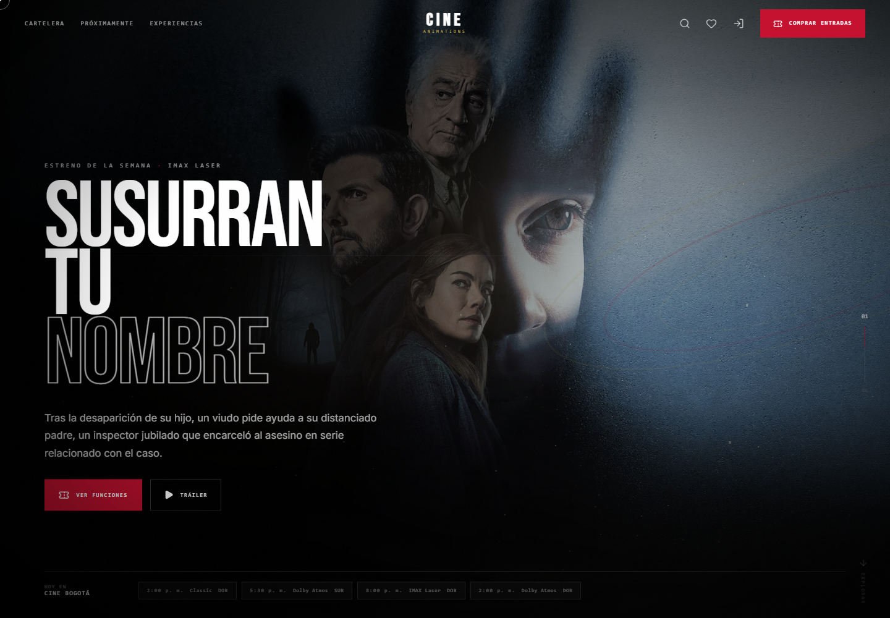
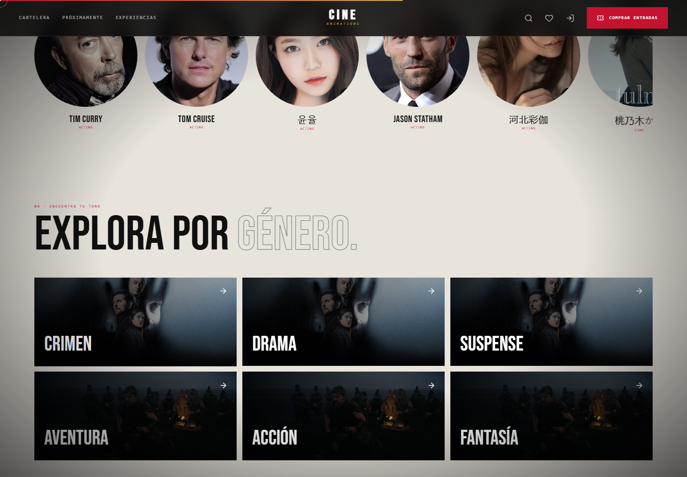
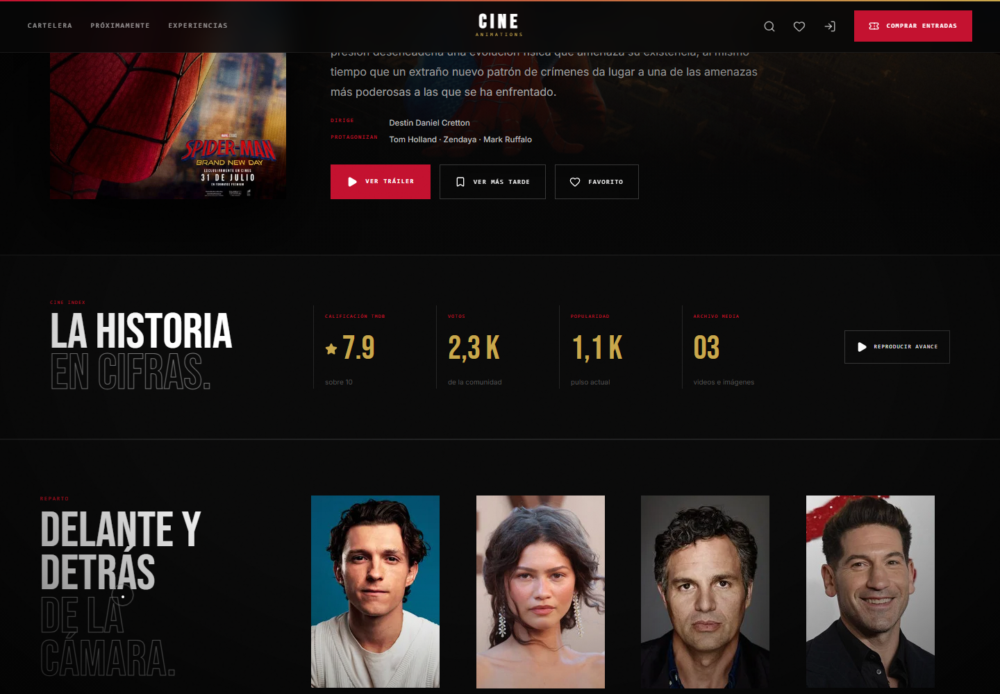
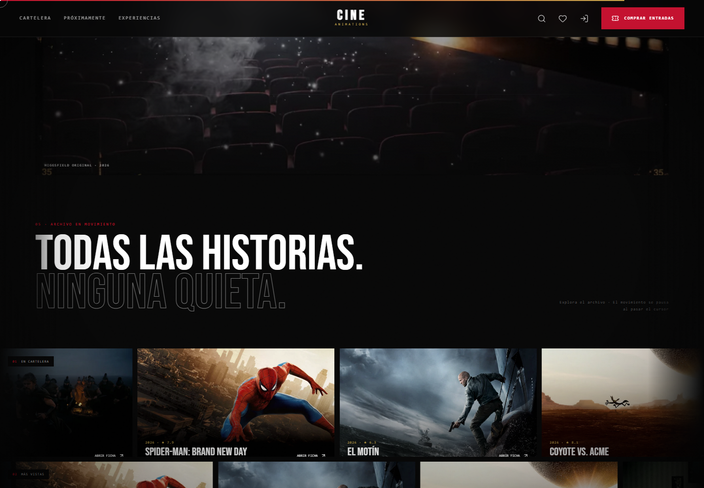
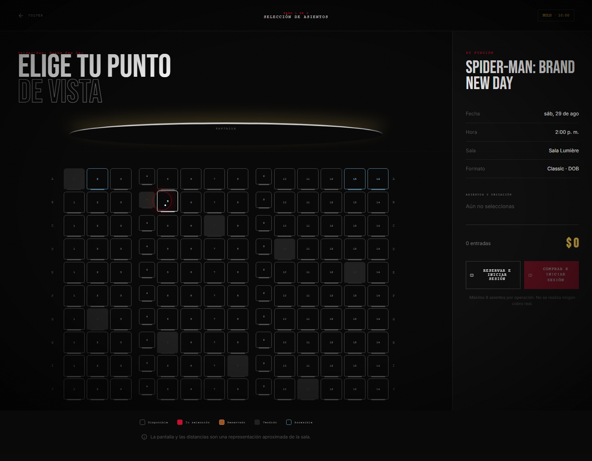
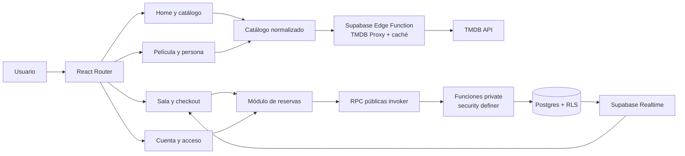
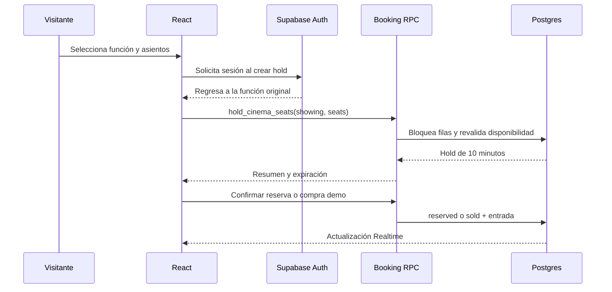

<div align="center">

# CINE ANIMATIONS

### Una cartelera premium que comienza antes de apagar las luces

[](https://react.dev/)
[](https://vite.dev/)
[](https://gsap.com/)
[](https://supabase.com/)
[](https://developer.themoviedb.org/)
[](https://playwright.dev/)

React, TMDB y Supabase convertidos en una experiencia de cine funcional para Bogotá: descubrir, elegir función, seleccionar asientos, reservar o completar una compra demostrativa.

</div>



## La experiencia

CINE ANIMATIONS combina navegación comercial inmediata con una narrativa visual inspirada en experiencias web cinematográficas. El usuario puede explorar sin cuenta; la autenticación aparece únicamente al confirmar un hold y devuelve a la función exacta que originó el flujo.

- Home inmersiva con media local optimizada, escena 3D diferida, horarios utilizables y secuencias GSAP.
- Descubrimiento tipo videoteca: Top 10, recomendaciones según actividad, crítica, próximos estrenos y carriles horizontales accesibles.
- Búsqueda global desde teclado (`/` o `Ctrl/⌘ + K`) y navegación por películas, personas y géneros.
- Cartelera de siete días con búsqueda por título o género, filtros de año, idioma y formato, y orden por popularidad, puntuación o estreno.
- Ficha con trailer bajo demanda, dirección, reparto, funciones, favoritos, valoración y reseña.
- Perfil individual de actores/directores con biografía, filmografía y enlaces sociales obtenidos de TMDB.
- Sala dinámica con pantalla curva, pasillos, zonas, accesibilidad, ubicación, ocho asientos máximos y estados Realtime.
- Reserva o compra demo diferenciadas, hold de diez minutos, revalidación y entrada digital.
- Archivo con entradas, reservas, favoritos, “Ver más tarde” e historial; las colecciones anónimas permanecen en el dispositivo y se fusionan al iniciar sesión.
- Login/registro/recuperación full-screen con retorno seguro al flujo de compra.

## Radar editorial



Las referencias de catálogo se reinterpretan como una superficie propia: talento en tendencia enlazado a biografías y filmografías, ventanas por género, señales agregadas de la selección y un índice detallado dentro de cada película.



## Archivo en movimiento



Los `MovieFrames` originales regresaron antes del footer. Ahora son tres loops GSAP bidireccionales, enlazan a fichas reales, se pausan con hover o control explícito y respetan `prefers-reduced-motion`. Sobre ellos aparece una pieza Higgsfield original de 4 segundos, servida localmente como MP4, WebM y póster WebP.

## Selección de asientos



El mapa se genera a partir de la función seleccionada y diferencia `available`, `selected`, `held`, `reserved`, `sold` y `accessible`. La interfaz informa código, zona física, cantidad, precio unitario y total; el navegador nunca actualiza disponibilidad directamente.

## Arquitectura





## Cobertura de requerimientos funcionales

| RF | Estado | Implementación |
|---:|:---:|---|
| RF-01 | ✅ | Cartelera TMDB/Supabase con fallback local normalizado |
| RF-02 | ✅ | Búsqueda por título y género; filtros adicionales por año e idioma |
| RF-03 | ✅ | Ficha con sinopsis, géneros, duración, estreno, dirección, protagonistas, reparto, trailer, puntuación y funciones |
| RF-04 | ✅ | Fecha, hora, sala, formato, precio COP y disponibilidad exacta |
| RF-05 | ✅ | Selección de una función identificable y navegable |
| RF-06 | ✅ | Mapa dinámico con seis estados visuales y semánticos |
| RF-07 | ✅ | Selección explícita por fila y número |
| RF-08 | ✅ | Ubicación frontal/media/posterior e izquierda/centro/derecha |
| RF-09 | ✅ | Selección múltiple y cantidad sincronizada; máximo ocho |
| RF-10 | ✅ | Nombre, correo, película, función, cantidad, asientos y revalidación |
| RF-11 | ✅ | Persistencia demo local o transaccional en Supabase |
| RF-12 | ✅ | Precio unitario, cantidad y total en COP |
| RF-13 | ✅ | Validaciones de sesión, términos, expiración, cantidad y conflicto |
| RF-14 | ✅ | Reserva marca `reserved`; compra marca `sold` |
| RF-15 | ✅ | Bloqueo de filas en RPC: dos usuarios no obtienen el mismo asiento |

## Stack

| Capa | Herramientas |
|---|---|
| UI | React 18, Vite 6, React Router, Tailwind CSS |
| Motion | GSAP, ScrollTrigger, Lenis, Framer Motion |
| 3D | Three.js, React Three Fiber, Drei |
| Datos | TMDB API, Supabase Postgres, Edge Functions |
| Identidad | Supabase Auth con fallback demo local |
| Seguridad | RLS, grants explícitos y RPC transaccionales |
| Calidad | Vitest, Playwright, ESLint |
| Media | Higgsfield, FFmpeg, MP4, WebM, WebP |

## Rutas

| Ruta | Propósito |
|---|---|
| `/` | Apertura, cartelera, formatos, archivo GSAP y cierre |
| `/cartelera` | Fechas, búsqueda, filtros, orden y horarios |
| `/pelicula/:id` | Detalle, trailer, reparto, funciones y reseña |
| `/persona/:id` | Biografía, filmografía y redes sociales |
| `/funcion/:id/asientos` | Selección y hold de asientos |
| `/checkout/:holdId` | Reserva o compra demostrativa |
| `/cuenta` | Entradas, favoritos, watchlist e historial |
| `/acceso` | Login, registro y recuperación |
| `/experiencias` | Classic, Dolby Atmos e IMAX Laser |

## Configuración local

Requisitos: Node.js 18+ y un TMDB Read Access Token.

```bash
npm install
```

Crea `.env.local`:

```dotenv
TMDB_TOKEN=tu_read_access_token_de_tmdb
VITE_TMDB_IMAGE_BASE=https://image.tmdb.org/t/p
VITE_SUPABASE_URL=
VITE_SUPABASE_PUBLISHABLE_KEY=
```

`TMDB_TOKEN` no se compila en el cliente. Durante desarrollo lo lee exclusivamente el middleware de Vite; en producción debe configurarse como secreto de la Edge Function:

```bash
supabase secrets set TMDB_TOKEN=tu_read_access_token_de_tmdb
supabase functions deploy tmdb-proxy
```

Ejecuta la aplicación:

```bash
npm run dev:vite
```

Sin credenciales Supabase, la aplicación conserva un modo demo funcional con autenticación, holds, reservas, compras, favoritos, reseñas e historial locales.

## Base de datos y seguridad

Aplica las migraciones de `supabase/migrations` en orden. Las tablas públicas de cartelera tienen lectura controlada; holds, reservas, entradas y valoraciones están aislados por usuario. Las mutaciones de disponibilidad solo ocurren mediante wrappers RPC públicos que delegan en funciones del esquema `private`.

```bash
supabase db push
```

## Calidad

```bash
npm run lint
npm test
npm run build
npm run test:e2e -- --project=chromium --project=mobile-chrome
```

La suite incluye precio total, temporizador, límite de selección, normalización TMDB, estados de asiento y 14 recorridos en escritorio/Pixel 7, incluidos búsqueda global y “Ver más tarde”. Para regenerar las capturas del README con el servidor activo:

```bash
node scripts/capture-readme.mjs
```

## Rendimiento y accesibilidad

- Lenis solo se activa en rutas narrativas y se omite en asientos, checkout y acceso.
- ScrollTriggers y timelines se revierten al desmontar cada ruta.
- Los trailers se cargan únicamente cuando se abre el reproductor.
- El video nuevo no hace autoplay en móvil ni con movimiento reducido; se usa WebP.
- R3F se carga de forma diferida y con DPR limitado.
- Los carruseles ofrecen pausa, foco de teclado y una variante sin movimiento.
- Todos los flujos críticos mantienen texto, labels y estados accesibles sin depender solo del color.

---

<div align="center">
  <strong>CINE ANIMATIONS · Bogotá, Colombia</strong><br/>
  <sub>Checkout demostrativo. No procesa pagos reales.</sub>
</div>
