<div align="center">

# CINE ANIMATIONS

### Una cartelera premium que comienza antes de apagar las luces

[](https://react.dev/)
[](https://vite.dev/)
[](https://gsap.com/)
[](https://supabase.com/)
[](https://developer.themoviedb.org/)
[](https://playwright.dev/)

React, TMDB y Supabase convertidos en una experiencia de cine funcional para Bogotá: descubrir, elegir función, seleccionar asientos, reservar o completar una compra demostrativa.

</div>

[Experiencia](#la-experiencia) · [Arquitectura y esquema de datos](docs/ARCHITECTURE.md) · [Pruebas](docs/TESTING.md) · [Features → develop](docs/CONTRIBUTING.md)

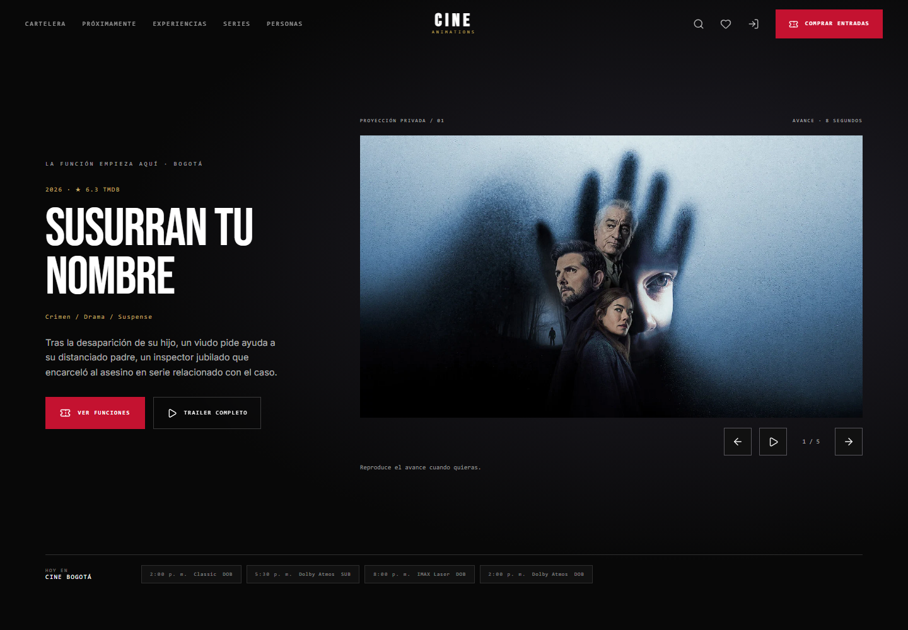

<details>
<summary>Vista móvil: reproducción bajo demanda y navegación de bolsillo</summary>

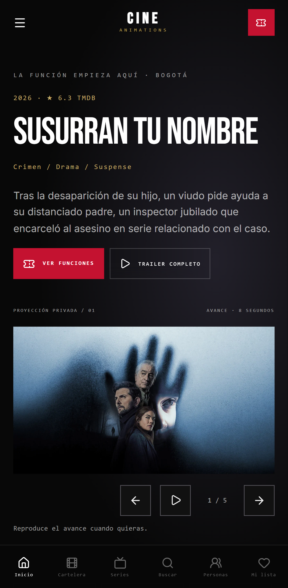

</details>

## La experiencia

CINE ANIMATIONS combina navegación comercial inmediata con una narrativa visual inspirada en experiencias web cinematográficas. El usuario puede explorar sin cuenta; la autenticación aparece únicamente al confirmar un hold y devuelve a la función exacta que originó el flujo.

- Home con hasta cinco películas TMDB y trailers reales de YouTube: avances silenciosos de ocho segundos de reproducción efectiva, pausa, cambio de título y funciones.
- Cartelera protagonista en profundidad 3D con GSAP: clic en pósteres laterales y flechas de teclado; sin rueda, arrastre, selección por hover ni autoavance.
- Descubrimiento tipo videoteca: Top 10, recomendaciones según actividad, crítica, próximos estrenos y carriles horizontales accesibles.
- Búsqueda global desde teclado (`/` o `Ctrl/⌘ + K`) y navegación agrupada por películas, series, personas y géneros.
- Cartelera de siete días con búsqueda por título o género, filtros de año, idioma y formato, y orden por popularidad, puntuación o estreno.
- Ficha con trailer bajo demanda, dirección, reparto, funciones, favoritos, valoración y reseña.
- Perfil individual de actores/directores con biografía, filmografía y enlaces sociales obtenidos de TMDB.
- Catálogo de series con tendencias, mejor valoradas, en emisión, búsqueda, temporadas, reparto, trailers, similares y watchlist sincronizable.
- Directorio de personas con muro 3D inspirado en interfaces multimedia, biografías, créditos de cine/TV y redes sociales.
- Sala dinámica con pantalla curva, escaleras iluminadas, pasillos, zonas, accesibilidad, ubicación, ocho asientos máximos y estados Realtime.
- Reserva o compra demo diferenciadas, hold de diez minutos, revalidación y entrada digital con diseño de ticket perforado.
- Archivo con entradas, reservas, favoritos, “Ver más tarde” e historial; las colecciones anónimas permanecen en el dispositivo y se fusionan al iniciar sesión.
- Login/registro/recuperación full-screen con retorno seguro al flujo de compra.

## Cartelera en movimiento

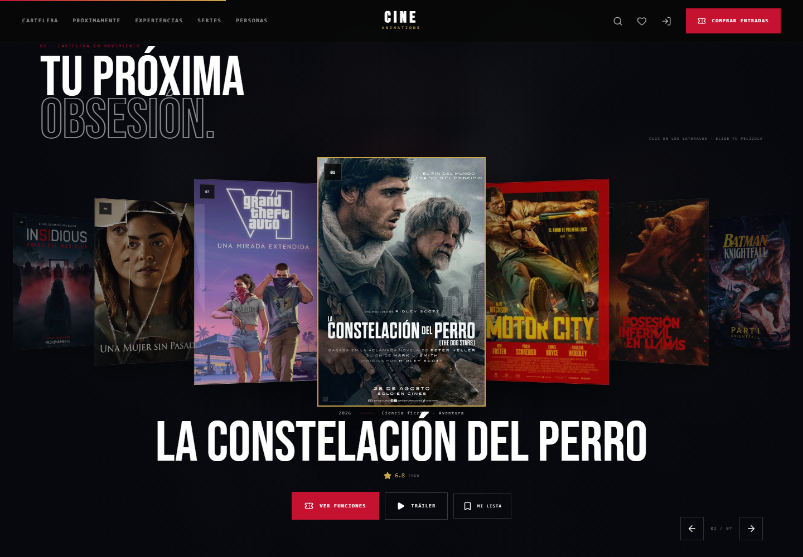

Siete películas rodean el foco. Pulsar un póster lateral o una flecha avanza una posición; pulsar el central abre su ficha. Hover y foco no cambian la selección, y el scroll vertical permanece libre. Las transiciones usan transformaciones y opacidad con limpieza al desmontarse.

## Proyección real, no vídeos de interfaces

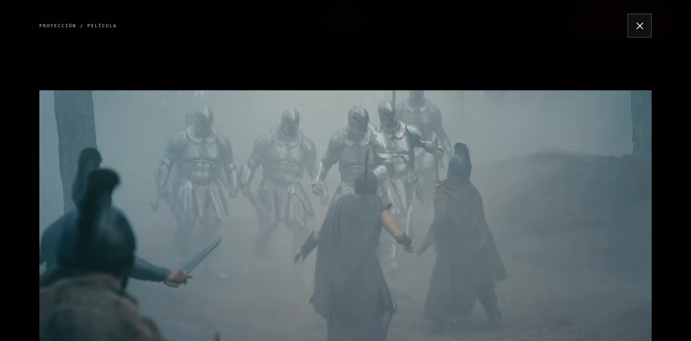

Los MP4 y el GIF de Cosmos se utilizan únicamente como referencias de diseño. No se sirven sus derivados: el abanico editorial, el muro curvo, los paneles y los tickets son componentes React/GSAP con contenido real de TMDB. Los originales del usuario no se modificaron.

`Catalog.getTrailerCandidates(mediaType, id, originalLanguage)` consulta los vídeos del título, elimina duplicados y prioriza trailers oficiales en español, inglés e idioma original. Ambos proxies permiten `/movie/:id/videos` y `/tv/:id/videos`. La caché de candidatos dura cinco minutos; una respuesta obsoleta no sustituye el título activo.

El iframe queda libre de texto y superposiciones. Solo un reproductor puede estar activo; se pausa al ocultar la pestaña, salir de pantalla o abrir el modal. En móvil, ahorro de datos y movimiento reducido se requiere clic. Si el navegador bloquea autoplay, aparece un control manual. No se descargan ni convierten vídeos de YouTube.

El modal inicia una consulta junto a un abanico 3D de unos 700 ms y monta el iframe después. Incluye Escape, restauración de foco, reintento, alternativas del mismo título y enlace externo si YouTube restringe la inserción. Los títulos ficticios del modo demo no se utilizan para buscar trailers de películas reales.

## Radar editorial

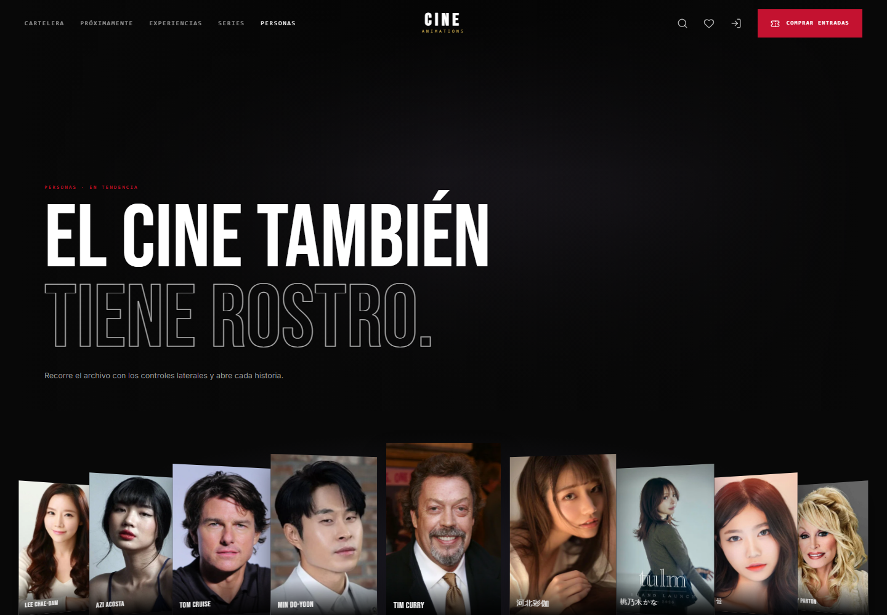


Las referencias de catálogo se reinterpretan como una superficie propia: talento en tendencia enlazado a biografías y filmografías, ventanas por género, señales agregadas de la selección y un índice detallado dentro de cada película.


## Archivo en movimiento


Los `MovieFrames` originales regresaron antes del footer. Son tres loops GSAP bidireccionales que enlazan a fichas reales y continúan durante el hover. Su botón permite pausarlos; también se suspenden fuera del viewport o con la pestaña oculta. En movimiento reducido quedan estáticos y desplazables manualmente. La escena superior es un abanico de pósteres interactivos, no un MP4.

## Selección de asientos


El mapa se genera a partir de la función seleccionada y diferencia `available`, `selected`, `held`, `reserved`, `sold` y `accessible`. La interfaz informa código, zona física, cantidad, precio unitario y total; el navegador nunca actualiza disponibilidad directamente.

El resumen ya no tiene scroll interno: toda la página se desplaza como una sola superficie. En tablet y móvil el resumen pasa debajo de la sala. Se utiliza el puntero nativo, sin círculo personalizado ni barra roja artificial. La cuadrícula conserva desplazamiento horizontal cuando el ancho de pantalla no permite mostrar todos los asientos.

## Del acceso a la entrada

| Acceso personal | Checkout demostrativo |
|---|---|
| 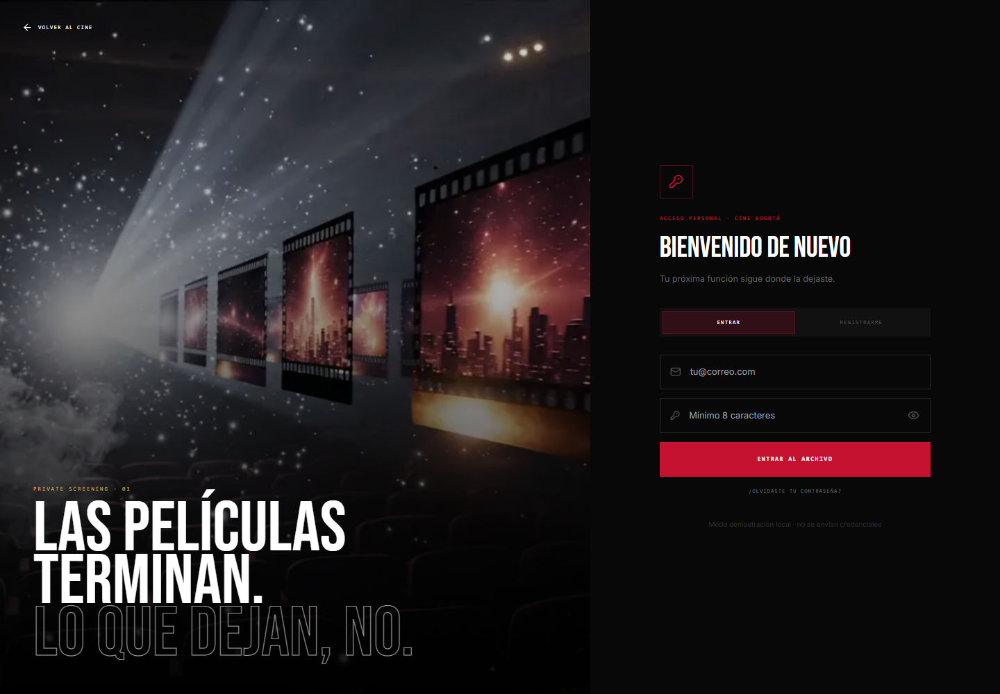 | 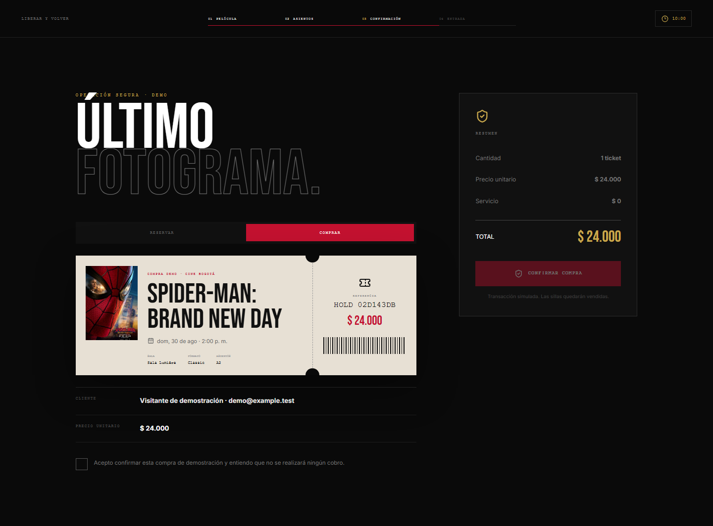 |

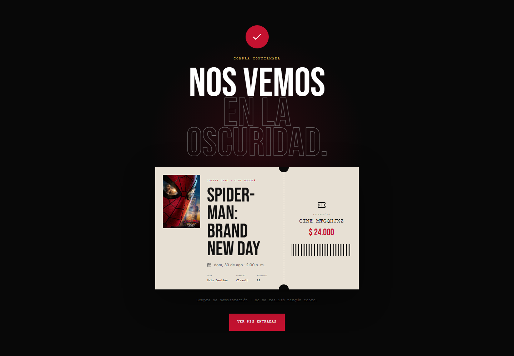

<details>
<summary>Series y sala móvil</summary>

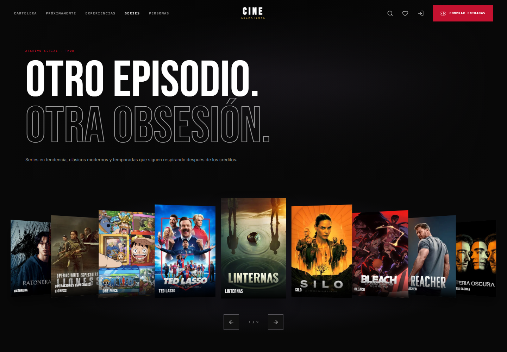

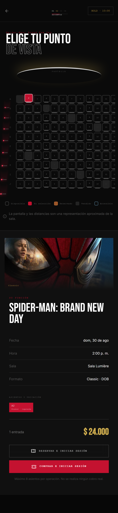

</details>

Las capturas de compra usan una identidad sintética y almacenamiento aislado: no se creó una reserva remota ni se cobró dinero. El [manifiesto de capturas](docs/images/capture-manifest.json) registra fecha, ruta y tamaño. Las imágenes actuales se capturan con movimiento reducido para mantenerlas estables; no representan una medición de FPS. La captura del modal de trailer se conserva de la verificación anterior.

## Arquitectura


Consulta el [documento técnico](docs/ARCHITECTURE.md) para el mapa de rutas, el esquema entidad-relación, los estados de disponibilidad y los límites entre demo local y backend remoto.

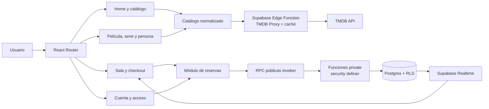

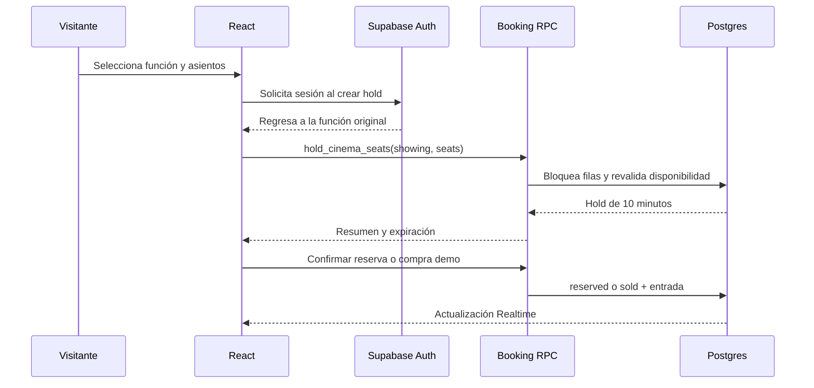

## Cobertura de requerimientos funcionales

Esta tabla describe la implementación existente, no una certificación del backend remoto. La concurrencia de reservas y las políticas desplegadas requieren verificación sobre una instancia Supabase configurada.

| RF | Estado | Implementación |
|---:|:---:|---|
| RF-01 | ✅ | Cartelera TMDB/Supabase con fallback local normalizado |
| RF-02 | ✅ | Búsqueda por título y género; filtros adicionales por año e idioma |
| RF-03 | ✅ | Ficha con sinopsis, géneros, duración, estreno, dirección, protagonistas, reparto, trailer, puntuación y funciones |
| RF-04 | ✅ | Fecha, hora, sala, formato, precio COP y disponibilidad exacta |
| RF-05 | ✅ | Selección de una función identificable y navegable |
| RF-06 | ✅ | Mapa dinámico con seis estados visuales y semánticos |
| RF-07 | ✅ | Selección explícita por fila y número |
| RF-08 | ✅ | Ubicación frontal/media/posterior e izquierda/centro/derecha |
| RF-09 | ✅ | Selección múltiple y cantidad sincronizada; máximo ocho |
| RF-10 | ✅ | Nombre, correo, película, función, cantidad, asientos y revalidación |
| RF-11 | ✅ | Persistencia demo local o transaccional en Supabase |
| RF-12 | ✅ | Precio unitario, cantidad y total en COP |
| RF-13 | ✅ | Validaciones de sesión, términos, expiración, cantidad y conflicto |
| RF-14 | ✅ | Reserva marca `reserved`; compra marca `sold` |
| RF-15 | ✅ | Bloqueo de filas en RPC: dos usuarios no obtienen el mismo asiento |

## Stack

Iconos SVG guardados en el repo; no dependen de un CDN para renderizar la documentación:

| Lenguajes | Interfaz | Datos y runtime | Calidad y versiones |
|---|---|---|---|
|  JavaScript |  React 18 |  Supabase |  Vitest |
|  HTML5 / JSX |  Vite 6 |  PostgreSQL / SQL |  Playwright |
|  CSS3 |  Tailwind CSS |  Node.js |  ESLint |
| JavaScript ESM |  Three.js / R3F / Drei | TMDB + YouTube APIs |  Git ·  GitHub |

[](https://gsap.com/)
[](https://motion.dev/)
[](https://reactrouter.com/)

Los iconos proceden de [Devicon v2.17.0](https://github.com/devicons/devicon/tree/v2.17.0), con [licencia incluida](docs/icons/LICENSE). Las marcas identifican tecnologías, no patrocinadores. `node scripts/sync-doc-icons.mjs` actualiza únicamente estos recursos documentales desde esa versión fijada.

| Capa | Herramientas |
|---|---|
| UI | React 18, Vite 6, React Router, Tailwind CSS |
| Motion | GSAP, ScrollTrigger, Lenis, Framer Motion |
| 3D | Three.js, React Three Fiber, Drei |
| Datos | TMDB API, Supabase Postgres, Edge Functions |
| Identidad | Supabase Auth con fallback demo local |
| Seguridad | RLS, grants explícitos y RPC transaccionales |
| Calidad | Vitest, Playwright, ESLint |
| Media | YouTube IFrame API, imágenes TMDB; medios locales previos fuera del hero |

## Rutas

| Ruta | Propósito |
|---|---|
| `/` | Apertura, cartelera, formatos, archivo GSAP y cierre |
| `/cartelera` | Fechas, búsqueda, filtros, orden y horarios |
| `/pelicula/:id` | Detalle, trailer, reparto, funciones y reseña |
| `/persona/:id` | Biografía, filmografía y redes sociales |
| `/personas` | Muro 3D, tendencias y directorio de talento |
| `/series` | Tendencias, populares, mejor valoradas y en emisión |
| `/serie/:id` | Temporadas, reparto, trailer, similares y Mi lista |
| `/funcion/:id/asientos` | Selección y hold de asientos |
| `/checkout/:holdId` | Reserva o compra demostrativa |
| `/cuenta` | Entradas, favoritos, watchlist e historial |
| `/acceso` | Login, registro y recuperación |
| `/experiencias` | Classic, Dolby Atmos e IMAX Laser |

## Configuración local

Requisitos para el conjunto completo de herramientas: Node.js **24.15+ dentro de la rama 24** (verificado con 24.18) o 22.22.2+ dentro de la rama 22, y un TMDB Read Access Token. El mínimo incluye Vitest/jsdom y React Router, no solo Vite.

```bash
npm install
```

Crea `.env.local`:

```dotenv
TMDB_TOKEN=tu_read_access_token_de_tmdb
VITE_TMDB_IMAGE_BASE=https://image.tmdb.org/t/p
VITE_SUPABASE_URL=
VITE_SUPABASE_PUBLISHABLE_KEY=
```

`TMDB_TOKEN` no se compila en el cliente. Durante desarrollo lo lee exclusivamente el middleware de Vite; en producción debe configurarse como secreto de la Edge Function:

```bash
supabase secrets set TMDB_TOKEN=tu_read_access_token_de_tmdb
supabase functions deploy tmdb-proxy
```

Ejecuta la aplicación:

```bash
npm run dev:vite
```

Sin credenciales Supabase, la aplicación conserva un modo demo funcional con autenticación, holds, reservas, compras, favoritos, reseñas e historial locales.

## Base de datos y seguridad

Aplica las migraciones de `supabase/migrations` en orden. Las tablas públicas de cartelera tienen lectura controlada; holds, reservas, entradas, valoraciones y la watchlist de series están aislados por usuario. `series_watchlist` declara grants explícitos y políticas RLS independientes para lectura, inserción, actualización y eliminación. Las mutaciones de disponibilidad solo ocurren mediante wrappers RPC públicos que delegan en funciones del esquema `private`.

```bash
supabase db push
```

## Calidad

Los resultados y límites de verificación se registran en [TESTING.md](docs/TESTING.md). La regresión incluye cursor nativo, scroll único, teclado, viewport corto, navegación, trailers, asientos y tickets en escritorio, tablet y Pixel 7. Las pruebas E2E controlan los servicios externos; no certifican el backend Supabase remoto ni disponibilidad permanente de YouTube.

Resultado local: **14 unitarias + 63 E2E correctas**, lint sin advertencias y build de producción correcto. Se incluyen nueve verificaciones nuevas de scroll/cursor.

```bash
npm run lint
npm test
npm run build
npm run test:e2e -- --project=chromium --project=tablet --project=mobile-chrome --workers=1
```

La suite incluye precio total, temporizador, límite de selección, normalización, imágenes únicas, prioridad de trailers, tiempo efectivo de reproducción y aislamiento de errores de colecciones. Playwright usa catálogo controlado y un adaptador de YouTube simulado para probar errores, autoplay bloqueado, portal, foco, pausa y navegación en escritorio, tablet y Pixel 7. La reproducción real se comprueba por separado en navegador; no se confunde el mock con una prueba de disponibilidad de YouTube. Para regenerar las capturas con catálogo real y el servidor activo:

```bash
node scripts/capture-readme.mjs
```

## Flujo de ramas

Base predeterminada: **`develop`**. Las features se publican como `codex/feature/...` y abren PR hacia `develop`, nunca hacia otra feature por accidente. La rama de catálogo conserva esta iteración hasta su revisión e integración: cambiar la rama por defecto no fusiona sus commits. Consulta [CONTRIBUTING.md](docs/CONTRIBUTING.md).

## Rendimiento y accesibilidad

- Lenis solo se activa en rutas narrativas y se omite en asientos, checkout y acceso.
- ScrollTriggers y timelines se revierten al desmontar cada ruta.
- Los trailers del hero hacen autoplay silencioso solo en escritorio y cuando son visibles; el trailer completo se carga tras la interacción.
- En móvil y movimiento reducido se muestra la imagen TMDB hasta solicitar reproducción.
- Los loaders usan seis pósteres o siluetas, sin esperas obligatorias ni porcentajes ficticios.
- Los carruseles ofrecen pausa, foco de teclado y una variante sin movimiento.
- Todos los flujos críticos mantienen texto, labels y estados accesibles sin depender solo del color.

### Estado de infraestructura

La migración `add_series_watchlist` y los endpoints nuevos del proxy deben desplegarse en la instancia de producción. Esta iteración no modifica las RPC de asientos ni realiza migraciones remotas. Si falla la tabla de series, se conserva la colección local y se informa en cuenta sin impedir cargar favoritos y películas por ver. No se han consumido créditos de generación de vídeo.

---

<div align="center">
  <strong>CINE ANIMATIONS · Bogotá, Colombia</strong><br/>
  <sub>Checkout demostrativo. No procesa pagos reales.</sub>
</div>
