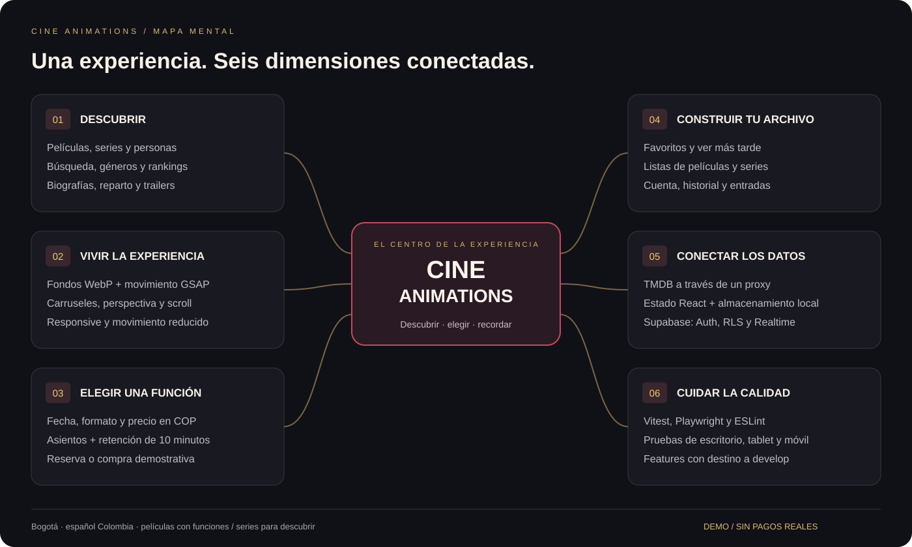
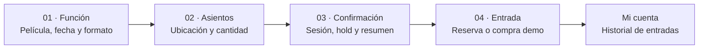
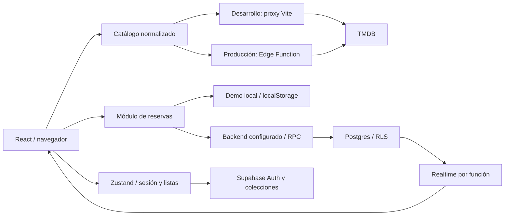
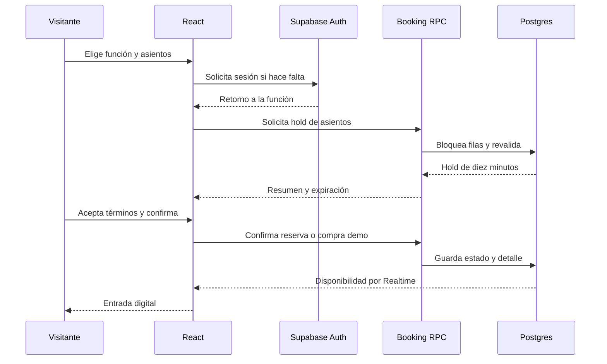
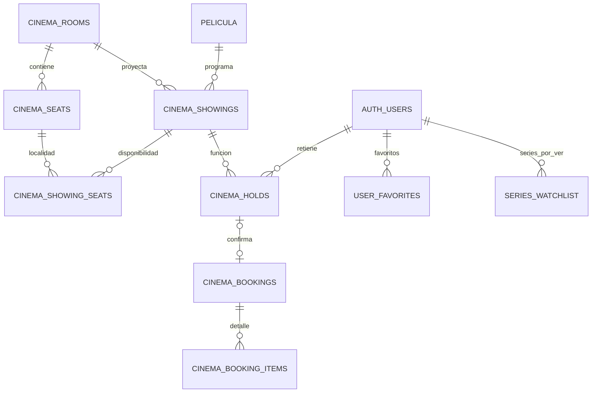
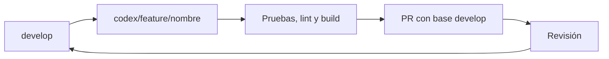

<div align="center">


# CINE ANIMATIONS

**Descubrir cine. Elegir una función. Construir tu archivo.**

Una experiencia web cinematográfica para Bogotá, con catálogo TMDB, animaciones GSAP y un recorrido de reserva y compra demostrativa.

<p>
  
  &nbsp;
  
  &nbsp;
  
  &nbsp;
  
  &nbsp;
  
  &nbsp;
  
  &nbsp;
  
</p>

**React 18 · Vite · JavaScript · Español Colombia · COP**

</div>

> **Estado del proyecto:** prototipo funcional con catálogo real de TMDB y compra demo. La última validación local registró **15 pruebas unitarias y 78 E2E correctas**, además de lint y build. Supabase no estaba configurado: autenticación real, correos, concurrencia y políticas remotas siguen pendientes de validación. [Ver evidencia y límites](docs/TESTING.md).

## Contenido

[Propósito](#proposito) · [Mapa mental](#mapa-mental) · [Funcionalidades](#funcionalidades) · [Galería](#galeria) · [Arquitectura](#arquitectura) · [Stack](#stack) · [Instalación](#instalacion) · [Calidad](#calidad) · [Contribuir](#contribuir)

<a id="proposito"></a>

##  Lo que buscamos con el programa

**Acercar el descubrimiento de una historia a la decisión de verla en una sala.** CINE ANIMATIONS reúne información que normalmente se consulta por separado: qué ver, quién participa, cuándo hay funciones y qué asientos elegir.

La propuesta combina tres objetivos:

| Objetivo | Cómo se traduce en el producto |
|---|---|
| **Ayudar a elegir** | Películas, series, reparto, biografías, géneros, rankings, filtros y trailers enlazados desde TMDB. |
| **Hacer tangible la experiencia del cine** | Fotografía a pantalla completa, movimiento editorial, formatos de sala, selección de asientos y entrada digital. |
| **Dar continuidad al descubrimiento** | Favoritos, listas de películas y series por ver, historial y archivo personal de entradas. |

Está pensado para personas que exploran cine y para demostrar un flujo completo de interfaz, datos y reserva. También funciona como proyecto de ingeniería frontend: conecta animación, accesibilidad, APIs, estado y pruebas en una SPA mantenible.

**Alcance:** una sede de demostración en Bogotá, tres formatos y precios COP. Las películas tienen funciones; las series y personas forman parte del catálogo editorial. No es un servicio de streaming, no reproduce capítulos completos y no procesa pagos reales.

<a id="mapa-mental"></a>

##  Mapa mental del producto



El centro es la experiencia del visitante. El catálogo, el movimiento y la tecnología están al servicio de ese recorrido, no sustituyen la compra ni esconden sus controles.

<a id="funcionalidades"></a>

##  Qué puede hacer el usuario

| Área | Funcionalidades |
|---|---|
| **Descubrimiento** | Cartelera, próximos estrenos, rankings, recomendaciones según actividad, búsqueda global de películas, series, personas y géneros. |
| **Cartelera** | Siete días de programación, formatos, horarios, búsqueda por título/género, año, idioma y orden por popularidad, puntuación o estreno. |
| **Películas y talento** | Sinopsis, puntuación, duración, reparto, dirección, biografía, filmografía de cine/TV y redes sociales disponibles en TMDB. |
| **Series** | Tendencias, populares, mejor valoradas, en emisión, temporadas, reparto, recomendaciones y lista de series por ver. |
| **Colección** | Favoritos, películas por ver, series por ver e historial. Listas anónimas locales y sincronización prevista al iniciar sesión con Supabase. |
| **Acceso** | Registro, login, confirmación de contraseña, recuperación y retorno al flujo que pidió la sesión. Sin Supabase se indica expresamente el modo demo. |
| **Sala y compra demo** | Función, mapa interactivo, máximo ocho asientos, retención temporal de diez minutos, resumen, términos y confirmación diferenciada de reserva/compra. |
| **Entrada digital** | Ticket con película, sede, sala, formato, fecha, asientos, total y referencia; consulta posterior desde la cuenta. |

### Un recorrido, cuatro pasos



Se puede explorar sin cuenta. La sesión se solicita al crear la retención de asientos; no es necesario iniciar sesión para descubrir el catálogo.

| Classic | Dolby Atmos | IMAX Laser |
|---|---|---|
| COP 24.000 | COP 34.000 | COP 42.000 |

Precios de la sede demo; zona horaria `America/Bogota`. [Matriz RF-01 a RF-15 y límites de aceptación](docs/REQUIREMENTS.md).

<a id="galeria"></a>

##  El programa en imágenes

### Portada editorial


Hasta cinco películas, fondos fotográficos WebP, fundidos y movimiento suave con GSAP cada ocho segundos. La composición conserva pausa y selección manual. **No hay iframes ni trailers descargados como fondo.**

### De la película a la butaca

| Descubrir en profundidad | Elegir asientos |
|---|---|
|  |  |

El selector de pósteres avanza por clic lateral, botones y teclado; no captura la rueda de la página. La sala conserva un único desplazamiento vertical y el puntero nativo.

| Acceder a tu archivo | Revisar antes de confirmar |
|---|---|
|  |  |


<details>
<summary><strong>Ver más: personas, series, géneros y ficha de película</strong></summary>

| Personas | Series |
|---|---|
|  |  |


</details>

<details>
<summary><strong>Ver más: trailers y archivo en movimiento</strong></summary>


Al pulsar trailer, un abanico GSAP acompaña la consulta a TMDB. Después aparece el enlace de YouTube con alternativa en la misma pestaña, Escape, restauración de foco y reintento. Sin candidato confirmado se ofrece una búsqueda por título identificada como tal, no un trailer de otra película.


Los carriles anteriores al footer siguen moviéndose durante el hover. Tienen pausa explícita, suspensión fuera de vista y variante estática con movimiento reducido. Los MP4/GIF de referencia se reinterpretan como componentes; no son grabaciones de otras interfaces reproduciéndose de fondo.

</details>

<details>
<summary><strong>Ver versión móvil: portada y sala</strong></summary>

<p align="center">
  
  &nbsp;
  
</p>

</details>

Las catorce capturas proceden de la aplicación con catálogo real y movimiento reducido. Las compras usan identidad sintética y almacenamiento aislado: **no crean reservas remotas ni cobran dinero**. [Manifiesto: fechas, rutas y viewports](docs/images/capture-manifest.json).

<a id="arquitectura"></a>

##  Arquitectura y mapa de navegación


La aplicación conserva **Vite + React 18 + JavaScript**. El frontend no se ha migrado a Next.js ni a TypeScript; la Edge Function sí contiene código TypeScript.

### Separación de responsabilidades

| Capa | Responsabilidad | Código |
|---|---|---|
| Presentación | Páginas, controles, escenas y diseño responsive | [pages](src/pages), [components](src/components), [styles](src/styles) |
| Navegación | Rutas, carga diferida y transiciones | [App.jsx](src/App.jsx) |
| Estado | Sesión, colecciones, historial y modal de trailer | [useStore.js](src/store/useStore.js) |
| Catálogo | Normalización de películas/series/personas y candidatos de trailer | [catalog.js](src/api/catalog.js), [cinema.js](src/api/cinema.js) |
| Transporte TMDB | Cliente sin token privado; proxy local o remoto | [tmdb.js](src/api/tmdb.js), [vite.config.js](vite.config.js), [Edge Function](supabase/functions/tmdb-proxy/index.ts) |
| Reservas | Funciones, selección, holds, confirmación y adaptador demo | [booking.js](src/api/booking.js), [cinema.js](src/data/cinema.js) |
| Persistencia remota | Tablas, restricciones, grants, RLS y RPC | [Migraciones](supabase/migrations) |



Las ramas «demo local» y «backend configurado» representan alternativas de ejecución. El token privado TMDB queda en el proxy; las operaciones remotas sobre disponibilidad pasan por RPC. El adaptador local **no garantiza exclusión entre dispositivos**.

### Mapa de rutas

| Descubrir | Elegir y reservar | Tu archivo |
|---|---|---|
| `/` — portada | `/cartelera` — fechas, filtros y horarios | `/acceso` — login, registro y recuperación |
| `/series` → `/serie/:id` | `/pelicula/:id` — ficha y funciones | `/cuenta` — entradas, listas e historial |
| `/personas` → `/persona/:id` | `/funcion/:id/asientos` — mapa | `/acceso?mode=update` — recuperación |
| `/experiencias` — formatos | `/checkout/:holdId` — confirmación | Retorno a la función tras iniciar sesión |

«Próximamente» utiliza `/cartelera?tab=proximamente`. La búsqueda y los enlaces de reparto conectan las fichas entre sí.

<details>
<summary><strong>Ver secuencia de reserva con backend Supabase configurado</strong></summary>



Este diagrama describe el contrato implementado; no acredita un despliegue remoto. El [esquema entidad-relación y los estados del asiento](docs/ARCHITECTURE.md) detallan tablas, claves y límites de confianza.

</details>

<details>
<summary><strong>Ver modelo de datos resumido y estructura del repositorio</strong></summary>



Vista resumida de las migraciones, no de una base de producción inspeccionada. El ticket se construye desde la reserva/compra y sus ítems; no se inventa una tabla adicional de entradas.

```text
cine-animations/
├── src/
│   ├── pages/          # Rutas y pantallas
│   ├── components/     # Interfaz y escenas animadas
│   ├── api/            # Catálogo, proxy y reservas
│   ├── store/          # Estado compartido
│   ├── data/           # Formatos y datos demo
│   └── styles/         # Diseño y variantes responsive
├── supabase/
│   ├── functions/      # Proxy remoto TMDB
│   └── migrations/     # Tablas, políticas y RPC
├── public/media/       # Imágenes y recursos locales
├── tests/              # Unitarias, fixtures y E2E
├── scripts/            # Capturas, WebP y documentación
└── docs/               # Arquitectura, SVG, imágenes y pruebas
```

</details>

<a id="stack"></a>

##  Stack tecnológico

Tecnologías declaradas en [package.json](package.json); [package-lock.json](package-lock.json) fija las versiones instaladas. Los iconos se guardan en el repositorio y no necesitan un CDN para mostrarse.

| Capa | Tecnologías | Uso |
|---|---|---|
| Lenguajes |  JavaScript ·  HTML/JSX ·  CSS | Frontend SPA y componentes |
| Interfaz |  React 18 ·  Vite 6 ·  Tailwind CSS 3 | Renderizado, desarrollo y diseño |
| Navegación y estado |  React Router ·  Zustand | Rutas, sesión y colecciones |
| Animación |  GSAP / ScrollTrigger ·  Framer Motion ·  Lenis | Timelines, transiciones y scroll narrativo |
| Escenas 3D |  Three.js ·  R3F ·  Drei | Escenas y presentación de formatos |
| Catálogo |  TMDB | Películas, series, personas, imágenes y metadatos de trailers |
| Backend |  Supabase ·  PostgreSQL / SQL | Auth, Edge Functions, RLS, RPC y Realtime |
| Recursos visuales |  Lucide ·  FFmpeg / WebP | Iconos SVG y optimización de imágenes |
| Runtime |  Node.js | Herramientas de desarrollo y scripts |
| Calidad |  Vitest ·  Playwright ·  ESLint | Unitarias, E2E y análisis estático |
| Versiones |  Git ·  GitHub | Features y revisión hacia `develop` |

`json-server` permanece como herramienta heredada en los scripts; **no es necesario levantar el puerto 3001 para el flujo actual**. Los detalles de procedencia y licencia de los logotipos/pictogramas están en [docs/icons/README.md](docs/icons/README.md).

<a id="instalacion"></a>

##  Ejecutar el proyecto

### 1. Preparar el entorno

Versión utilizada en la última validación: **Node.js 24.18**. Instala las dependencias desde la carpeta del repositorio:

```bash
npm ci
```

### 2. Configurar el catálogo

Crea `.env.local` con tus propios valores:

```dotenv
TMDB_TOKEN=tu_read_access_token_de_tmdb
VITE_TMDB_IMAGE_BASE=https://image.tmdb.org/t/p
VITE_SUPABASE_URL=
VITE_SUPABASE_PUBLISHABLE_KEY=
```

- `TMDB_TOKEN` es privado y solo lo lee el proxy del servidor.
- Las variables `VITE_*` son públicas: no colocar ahí el token TMDB ni una clave `service_role`.
- Sin Supabase se activa la demo local. No envía correos ni autentica identidades reales.
- Nunca subir `.env.local`, credenciales o datos personales al repositorio.

### 3. Abrir la aplicación

```bash
npm run dev:vite
```

Visita [localhost:5173](http://localhost:5173/). Si otro proyecto ocupa ese puerto, revisa la URL que imprime Vite antes de abrirla.

### Desarrollo local y producción no son lo mismo

| Entorno | Catálogo | Cuenta y reservas |
|---|---|---|
| Desarrollo sin Supabase | Proxy Vite → TMDB; fallback demo si falla el catálogo | Simulación en el dispositivo |
| Backend configurado | Catálogo publicado y consultas TMDB normalizadas | Supabase Auth, colecciones y RPC |
| Build de producción | Requiere Edge Function o infraestructura de proxy configurada | Requiere migraciones, permisos y servicios validados |

`npm run preview` sirve el build; **no sustituye al middleware de desarrollo ni despliega una API**. Antes de publicar se deben configurar el secreto TMDB del proxy remoto, las migraciones, las URLs de Auth y el retorno de rutas SPA. [Arquitectura e infraestructura pendiente](docs/ARCHITECTURE.md).

La exposición de tablas requiere revisar tanto grants como RLS; no se debe confundir acceso al Data API con autorización sobre filas. [Guía oficial de Supabase](https://supabase.com/docs/guides/api/securing-your-api).

<a id="calidad"></a>

##  Calidad, accesibilidad y mantenimiento

**Última ejecución de la aplicación, 31 de agosto de 2026:** 15 unitarias y 78 pruebas de navegador correctas; lint y build correctos. Esta cifra pertenece a esa ejecución, no a un indicador de CI en tiempo real. [Matriz de pruebas y limitaciones](docs/TESTING.md).

```bash
npm run lint
npm test
npm run build
npm run pw:install -- chromium
npm run test:e2e -- --project=chromium --project=tablet --project=mobile-chrome --workers=2
```

La cobertura incluye navegación, filtros, favoritos, listas, registro/login demo, retorno, trailers externos, rotación, titulares completos, scroll, asientos y tickets. Firefox/WebKit, correo real y concurrencia remota no están certificados por esos resultados.

### Movimiento que se puede controlar

- Fondos con pausa, flechas y suspensión al ocultar la pestaña o abrir el trailer.
- `prefers-reduced-motion` y ahorro de datos desactivan la rotación automática del hero.
- Lenis se limita a rutas narrativas; asientos y checkout mantienen scroll normal.
- El mapa indica estados y ubicación sin depender solo del color.
- Loaders sin porcentajes inventados ni esperas obligatorias.
- Contextos GSAP y temporizadores se limpian al desmontar las escenas.

### Recursos y documentación reproducibles

```bash
# Con Vite activo: cinco fondos TMDB en WebP 960/1600
node scripts/build-editorial-webp.mjs

# Capturas reales; compras aisladas en modo demo
node scripts/capture-readme.mjs

# Validación de enlaces y recursos locales de la documentación
node scripts/check-docs.mjs
```

Los fondos locales se usan únicamente cuando coinciden ID y backdrop con el manifiesto; títulos nuevos usan imágenes de TMDB. No se descargan vídeos de YouTube ni se consumen créditos de generación para este pipeline.

<a id="contribuir"></a>

##  Desarrollo por features

La base de integración es **`develop`**. Cada feature parte de ella y se propone mediante un PR con destino a `develop`.



No se fusionan ramas automáticamente ni se reescribe su historial como parte de la documentación. [Guía de contribución y checklist](docs/CONTRIBUTING.md).

### Biblioteca de documentación

| Documento | Contenido |
|---|---|
| [Arquitectura](docs/ARCHITECTURE.md) | Mapa completo de rutas, módulos, esquema entidad-relación, estados y seguridad |
| [Mapa mental SVG](docs/mindmap.svg) | Objetivos del producto y sus conexiones |
| [Requerimientos](docs/REQUIREMENTS.md) | Matriz RF-01 a RF-15 y límites de aceptación |
| [Pruebas](docs/TESTING.md) | Resultados, comandos, entornos y verificaciones pendientes |
| [Contribución](docs/CONTRIBUTING.md) | Flujo de features y revisión |
| [Capturas](docs/images/capture-manifest.json) | Fecha, ruta y viewport de cada imagen |
| [Iconos](docs/icons/README.md) | Procedencia y licencias de recursos SVG |

### Antes de pasar a producción

- Desplegar y comprobar el proxy TMDB y las migraciones.
- Validar Auth, recuperación de correo, RLS y aislamiento entre cuentas.
- Probar reservas concurrentes y expiración de holds contra Postgres.
- Revisar accesibilidad, rendimiento y navegadores objetivo.
- Mantener claramente identificado el checkout demostrativo; no añadir cobros implícitos.

---

<div align="center">

**CINE ANIMATIONS · Bogotá**

Una forma de descubrir historias y explorar la experiencia del cine.<br/>
**Demo de reservas. Sin pagos reales. Sin reproducción de películas completas.**

</div>
