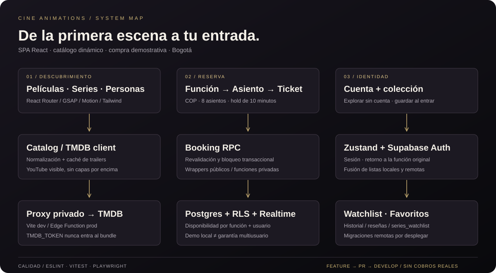
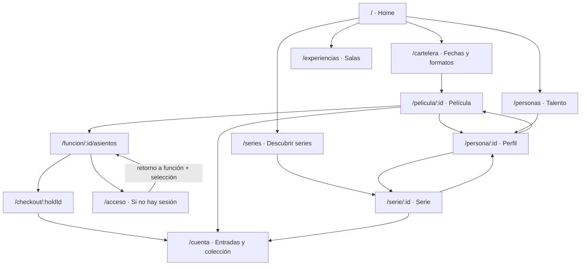
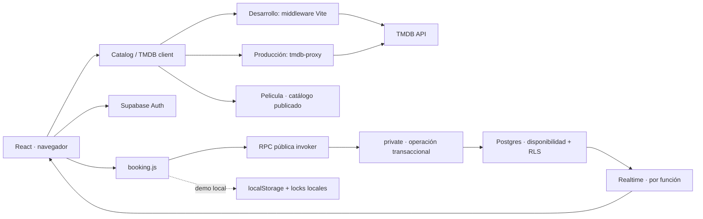
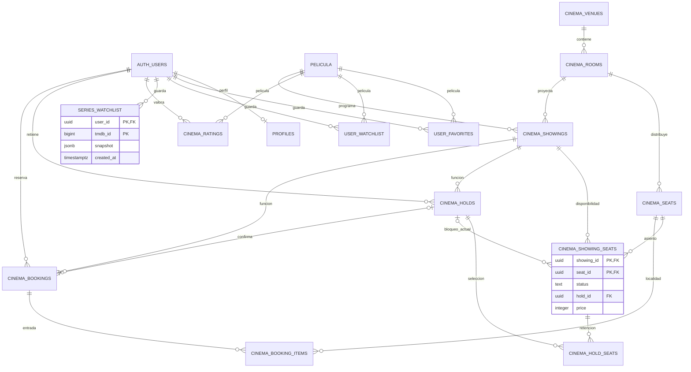
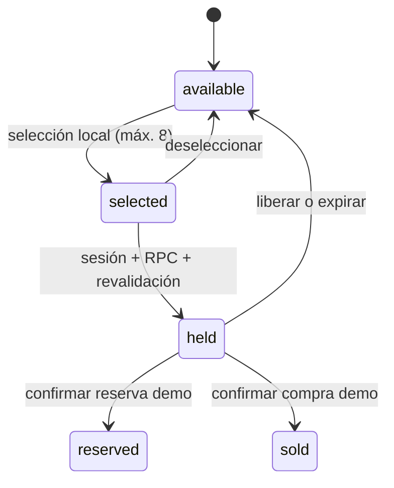

# Arquitectura · CINE ANIMATIONS

[← README](../README.md) · [Pruebas](TESTING.md) · [Flujo Git](CONTRIBUTING.md)

## Límites del sistema

SPA React 18 con Vite y JavaScript. No utiliza Next.js ni reproduce películas o capítulos completos. Las series y las personas son descubrimiento editorial; únicamente las películas tienen funciones y reservas. El checkout es demostrativo y no contiene una pasarela de cobro.

| Responsabilidad | Implementación |
|---|---|
| Rutas y transición | `src/App.jsx`, React Router, Framer Motion |
| Estado compartido | `src/store/useStore.js`, Zustand, sesión, listas y modal |
| Catálogo | `src/api/catalog.js`, normalización, candidatos de trailer y caché |
| Transporte privado | `src/api/tmdb.js` → proxy Vite en desarrollo / Edge Function en producción |
| Reserva y disponibilidad | `src/api/booking.js` → RPC Supabase o adaptador demo local |
| Presentación | `src/components`, `src/pages`, Tailwind y CSS; GSAP acotado por componente |
| Datos persistentes | Migraciones en `supabase/migrations`; estado remoto no certificado por el build |

## Mapa de navegación

La búsqueda global ofrece accesos a películas, series, personas y géneros. En móvil mantiene controles visibles; el foco y las flechas no dependen de un cursor artificial.

## Datos y confianza

`TMDB_TOKEN` existe únicamente en el servidor/proxy. Las claves `VITE_*` son públicas: jamás deben contener un token TMDB privado ni `service_role`. Las peticiones aceptadas se limitan en ambos proxies. Los wrappers de reserva comprueban el usuario y delegan a funciones privadas; el navegador no modifica filas de disponibilidad directamente.

El adaptador demo no es una base compartida: sus locks no garantizan exclusión entre dispositivos. La garantía multiusuario requiere las RPC y migraciones desplegadas y probadas en Postgres. Los tests de navegador sustituyen servicios externos; no verifican esas garantías remotas.

## Esquema relacional

Diagrama derivado de las migraciones del repositorio; no representa una inspección de producción. `Pelicula` es el catálogo preexistente. Las entradas digitales se construyen con `cinema_bookings` y `cinema_booking_items` (no hay tabla adicional de tickets).

## Vida de una reserva

`selected` solo vive en React; `accessible` es una característica del asiento. No son estados persistidos de la disponibilidad. El hold dura diez minutos; precios COP, sede Bogotá y zona horaria `America/Bogota`.

## Motion, scroll y reproducción

- Scroll vertical único del documento: el resumen de asientos no tiene altura fija ni scroll propio. Hasta 1100 px pasa debajo del mapa; solo la cuadrícula puede desplazarse horizontalmente en móviles estrechos.
- Puntero nativo del sistema. Hover conserva feedback visual y los controles de teclado siguen activos.
- GSAP anima transformaciones/opacidad y revierte contextos al desmontarse. El marquee no se detiene con hover; tiene pausa explícita y suspensión fuera de vista.
- `RotatingHero` sincroniza fotografía, título, géneros y funciones cada ocho segundos. `EditorialBackdrop` carga y funde dos imágenes, usa WebP local cuando coincide el ID/backdrop del manifiesto y recurre a TMDB para nuevos títulos. El avance se pausa fuera de vista, al ocultar la pestaña o abrir el modal.
- `TrailerModal` ejecuta un abanico y muestra enlaces al candidato de YouTube confirmado, con alternativa en la misma pestaña. No hay iframe, SDK ni descarga del vídeo.
- Ahorro de datos y movimiento reducido desactivan la rotación y el desplazamiento de fondos. Los controles manuales y todo el contenido permanecen disponibles.

### ¿Por qué no un trailer YouTube detrás del texto?

Las [reglas del reproductor de YouTube](https://developers.google.com/youtube/terms/required-minimum-functionality#overlays-and-frames) impiden tapar cualquier parte del iframe con contenido. Las [políticas de datos audiovisuales](https://developers.google.com/youtube/terms/developer-policies) también restringen descargar/cachear sus vídeos sin autorización. Servirlo desde localhost no cambia esas condiciones.

Para un verdadero fondo sin el marco de YouTube se necesita un MP4/WebM entregado por el titular con autorización de uso y alojamiento. Con ese recurso, un `<video muted playsInline>` puede ir detrás de la composición, con pausa, fallback de imagen y restricciones de autoplay. **Esta corrección usa fondos fotográficos WebP, no trailers descargados.** Los clips de Cosmos siguen siendo referencias, no fondos.

## Pendiente de infraestructura

El despliegue del proxy y la migración `20260830153054_add_series_watchlist.sql` no se ejecutó en esta sesión. Realtime, RLS y concurrencia deben validarse en un entorno Supabase con cuentas de prueba antes de afirmar disponibilidad productiva.
