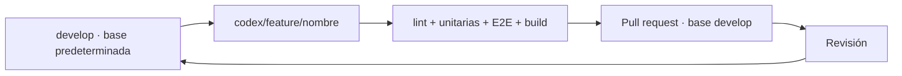

# Desarrollo por features

[← README](../README.md)

`develop` es la rama base de integración y la predeterminada del repositorio. Las nuevas features parten de ella y se proponen mediante PR con **base `develop`**. `master` se conserva; cambiar la rama predeterminada no fusiona ni elimina ramas.



```bash
git fetch origin
git switch develop
git pull --ff-only origin develop
git switch -c codex/feature/nombre
# Implementar y comprobar
npm run lint
npm test
npm run build
npm run test:e2e -- --project=chromium --project=tablet --project=mobile-chrome --workers=1
git push -u origin codex/feature/nombre
gh pr create --base develop --head codex/feature/nombre
```

Si no existe `develop` local, usar `git switch --track origin/develop` antes de crear una nueva feature. No cambiar de rama con trabajo sin guardar. La feature activa de catálogo conserva sus cambios previos; no se reescribe el historial ni se fuerza ningún push.

## Checklist del PR

- [ ] Base `develop`, feature con nombre descriptivo.
- [ ] Lint, pruebas y build correctos; indicar qué usa mocks y qué fue probado en vivo.
- [ ] Capturas actualizadas para cambios visuales, incluidos móvil y movimiento reducido.
- [ ] Migraciones y despliegues pendientes identificados, sin afirmar que el build los aplica.
- [ ] Sin `.env.local`, tokens, cuentas reales o datos personales en commits/capturas.
- [ ] Sin vídeos de referencia convertidos en fondos ni descargas de YouTube.

Las ramas antiguas se conservan por trazabilidad. No se abren PR duplicados de features ya incorporadas en otra; ningún PR se fusiona automáticamente como parte de la documentación.
